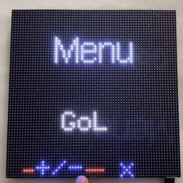
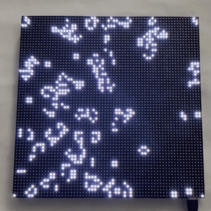
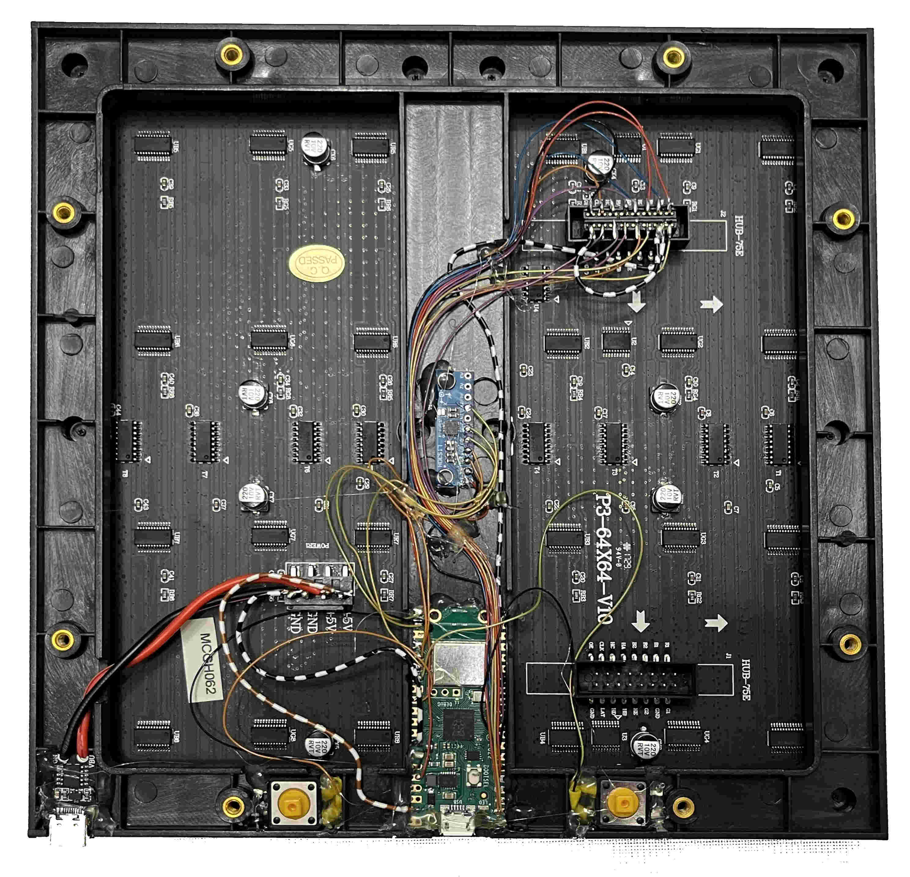
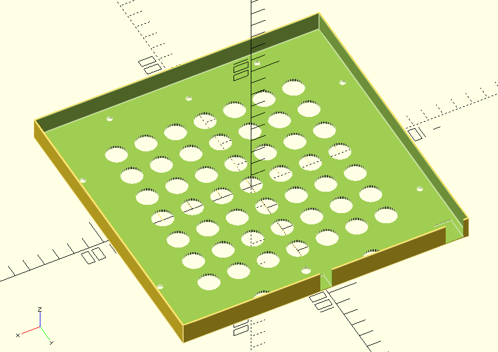
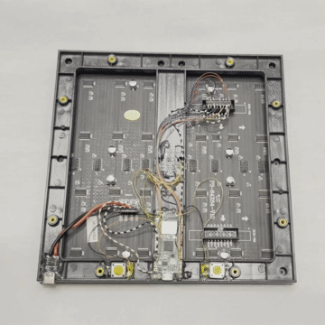
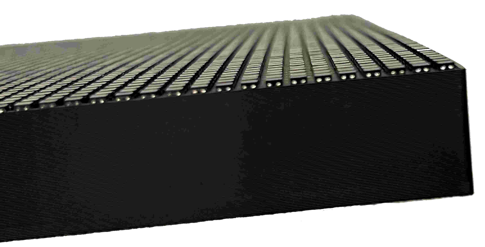
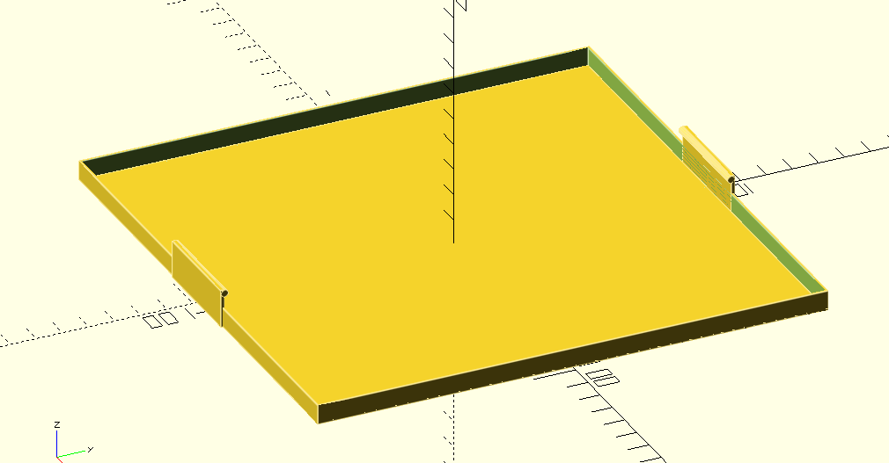
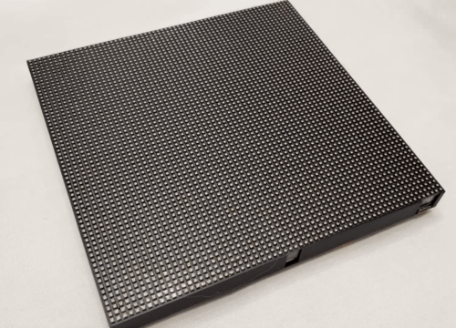

# GameGrid64

GameGrid64 is a 64x64 LED Matrix gaming console that was created as a weekend project.

  

</td>
<td>

It is based on a Hub75 matrix panel driven by a Raspberry Pi Pico (RP2040) and equipped with two buttons and an accelerometer. In the current version, the software includes a simple app manager, Conway's Game of Life animation, and a game. Besides games, the panel can be used as a wall clock and an internet-connected display (e.g., subscriber counter).

<table>
<tr>
<th>App Manager Menu</th>
<th>Conway's Game of Life</th>
</tr>
<tr>
<td>

  

</td>
<td>

  

</td>
</tr>
</table>

## Build

The electronics are built into the original frame to keep the form factor as small as possible. Cutouts for wiring can be easily added by some pliers as the plastics are pretty brittle. Pinout: see the bottom of the page.

  

### Cover
Add the back-side cover.

<table>
<tr>
<td>

  

</td>
<td>

  

</td>
</tr>
</table>

Make sure it is well aligned

  

and secure it with some M3 screws.

  

You can add the front cover to ensure the LEDs are protected when transporting the panel.

<table>
<tr>
<td>

  

</td>
<td>

  

</td>
</tr>
</table>

### Pinout

| Name         | Pin |
| ------------ | --- |
| BTN0         | 22  |
| BTN1         | 21  |
| LIS3DH_CIPO  | 16  |
| LIS3DH_CS    | 17  |
| LIS3DH_CLK   | 18  |
| LIS3DH_COPI  | 19  |
| LIS3DH_INT1  | 20  |
| DMD_PIN_nOE  | 15  |
| DMD_PIN_SCLK | 12  |
| HUB75 A      | 6   |
| HUB75 B      | 7   |
| HUB75 C      | 8   |
| HUB75 D      | 9   |
| HUB75 E      | 10  |
| HUB75 CLK    | 11  |
| HUB75 R0     | 0   |
| HUB75 G0     | 1   |
| HUB75 B0     | 2   |
| HUB75 R1     | 3   |
| HUB75 G1     | 4   |
| HUB75 B1     | 5   |

## Firmware

see `firmware/`