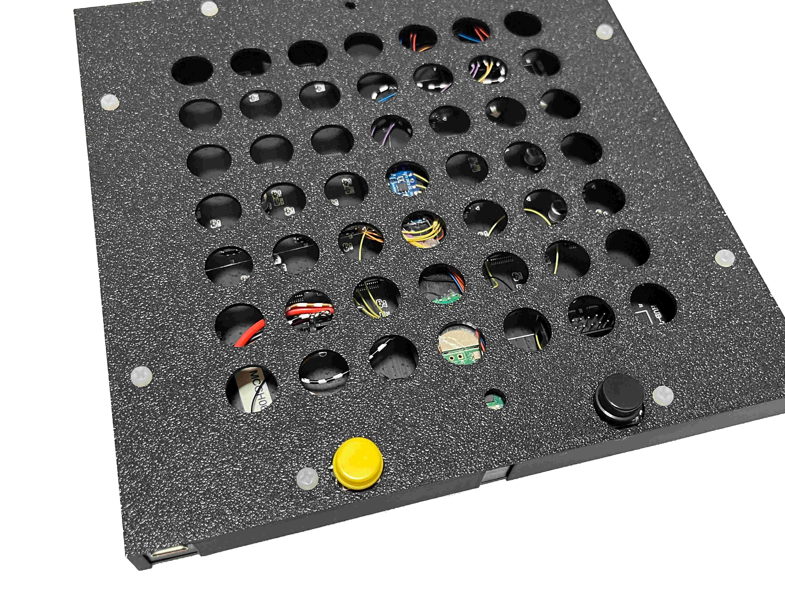

# GameGrid64

GameGrid64 is a 64x64 LED Matrix gaming console that was created as a weekend project.

<p align="center">
  
</p>
</td>
<td>

It is based on a Hub75 matrix panel driven by a Raspberry Pi Pico (RP2040) and equipped with two buttons and an accelerometer. In the current version, the software includes a simple app manager, Conway's Game of Life animation, and a game. Besides games, the panel can be used as a wall clock and an internet-connected display (e.g., subscriber counter).


<table>
<tr>
<th>App Manager Menu</th>
<th>Conway's Game of Life</th>
</tr>
<tr>
<td>

<p align="center">
  
</p>

</td>
<td>

<p align="center">
  
</p>

</td>
</tr>
</table>


## Build

### Material

| Name                                            | Quantity |
| ----------------------------------------------- | :------: |
| 64x64 Hub75 LED Matrix                          |    1     |
| Raspberry Pi Pico RP2040 (optional Wifi)        |    1     |
| LIS3DH                                          |    1     |
| Buttons                                         |    2     |
| Optional External Power Supply, e.g., via USB-C |    1     |

An external power supply is needed for higher brightness. Warning: the panel can be **very** bright. Start with low values and increment iteratively.

### Instructions

The electronics are built into the original frame to keep the form factor as small as possible. Cutouts for wiring can be easily added by some pliers as the plastics are pretty brittle. Pinout: see the bottom of the page.

<p align="center">
  
</p>


### Cover
Add the back-side cover.


<table>
<tr>
<td>

<p align="center">
  
</p>

</td>
<td>

<p align="center">
  
</p>

</td>
</tr>
</table>

Make sure it is well aligned

<p align="center">
  
</p>

and secure it with some M3 screws.

<p align="center">
  
</p>

You can add the front cover to ensure the LEDs are protected when transporting the panel.

<table>
<tr>
<td>

<p align="center">
  
</p>

</td>
<td>

<p align="center">
  
</p>

</td>
</tr>
</table>


### Pinout

| Name         | Pin |
| ------------ | --- |
| BTN0         | 22  |
| BTN1         | 21  |
| LIS3DH_CIPO  | 16  |
| LIS3DH_CS    | 17  |
| LIS3DH_CLK   | 18  |
| LIS3DH_COPI  | 19  |
| LIS3DH_INT1  | 20  |
| DMD_PIN_nOE  | 15  |
| DMD_PIN_SCLK | 12  |
| HUB75 A      | 6   |
| HUB75 B      | 7   |
| HUB75 C      | 8   |
| HUB75 D      | 9   |
| HUB75 E      | 10  |
| HUB75 CLK    | 11  |
| HUB75 R0     | 0   |
| HUB75 G0     | 1   |
| HUB75 B0     | 2   |
| HUB75 R1     | 3   |
| HUB75 G1     | 4   |
| HUB75 B1     | 5   |

## Firmware

The firmware is based on PlatformIO and builds on the Arduino framework layer. A system object is globally allocated that abstracts hardware-specific calls for the games. An app manager allows to select and switch between different apps (e.g., games). Apps are derived from `Playable` and are registered to the app manager after system initialization.

```C
System sys = System();

AppManager appm = AppManager(&sys);

PGoL pgol       = PGoL(50, 100);
PBalance pbal   = PBalance();
PGCollect pgcol = PGCollect();

void setup(void)
{
  Serial.begin(9600);
  sys.init();
  appm.registerPlayable(&pgol);
  appm.registerPlayable(&pbal);
  appm.registerPlayable(&pgcol);
}
```

The main loop synchronizes the game speed to a defined frame rate. It updates the system state and calls the app manager, who directs to the currently selected application. The application draws to a frame buffer that is swapped in `sys.loopEnd();`. The active buffer is used to update the latched data in the LED panel by hardware support.

```C
void loop(void)
{
  uint32_t interval = 20;  
  uint32_t prev_step = 0;
  uint32_t printed = 0;

  while(1)
 {
    if ((millis() - prev_step) > interval)
 {
      prev_step = millis();
      sys.loopBegin();
      appm.loop();
      sys.loopEnd();
 }
 }
}
```